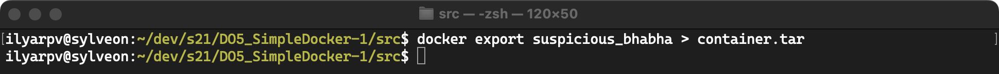

# Simple Docker report

## Part 1. Ready-made docker

* Take the official docker image from **nginx** and download it using `docker pull`.

* Check for the docker image with `docker images`

* Run docker image with `docker run -d [image_id|repository]`

* Check that the image is running with `docker ps`

* View container information with `docker inspect [container_id|container_name]`

* From the command output define and write in the report the container size, list of mapped ports and container ip
  * 
    *`SizeRootFs`: the total size of all the files in the container, in bytes `SizeRw`: the size of the files that have been created or changed in the container, compared to it's image, in bytes*

  * 
    *mapped ports is `80/tcp`*

  * 
    *container ip is `172.17.0.2`*

* Stop docker image with `docker stop [container_id|container_name]`

* Check that the image has stopped with `docker ps`

* Run docker with ports 80 and 443 in container, mapped to the same ports on the local machine, with *run* command

* Check that the **nginx** start page is available in the browser at *localhost:80*

* Restart docker container with `docker restart [container_id|container_name]`

* Check in any way that the container is running

## Part 2. Operations with container

* Read the *nginx.conf* configuration file inside the docker container with the *exec* command

* Create a *nginx.conf* file on a local machine

* Configure it on the */status* path to return the **nginx** server status page

* Copy the created *nginx.conf* file inside the docker image using the `docker cp` command

* Restart **nginx** inside the docker image with *exec*

* Check that *localhost:80/status* returns the **nginx** server status page

* Export the container to a *container.tar* file with the *export* command

* Stop the container

* Delete the image with `docker rmi [image_id|repository]`without removing the container first

* Delete stopped container

* Import the container back using the *import* command

* Run the imported container

* Check that *localhost:80/status* returns the **nginx** server status page

